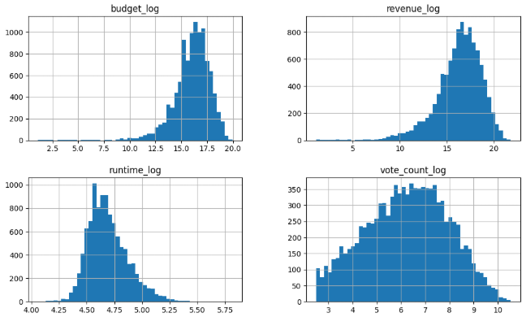

# **MovieMatch AI: Content-Based Movie Recommendation System**
## [Try It Out!](https://movie-match-ai.streamlit.app/) (10 second wait if asleep)

This project delivers an end-to-end pipeline for collecting, cleaning, tuning, and deploying movie metadata from TMDb and IMDb to build a personalized recommendation engine. Designed to provide intelligent movie suggestions based on content similarity, the system uses sentence embeddings, TF-IDF features, and structured metadata combined with optimized feature weighting and a KNN backend to recommend films similar to those users already love.

A key goal of this system is to combine *semantic depth* (via natural language embeddings) with *structural precision* (cast, crew, runtime, themes, etc.), all tuned for maximum real-world recommendation accuracy given data limitations.

---

## Code Files Included (Ctrl+Click to view respective file)

| File | Description |
|------|-------------|
| [`movie_join.ipynb`](https://github.com/willmizer/movie_data_analysis/blob/main/merging_imdb/movie_join.ipynb) | Uses IMDbs publicly available datasets to collect and store information including the tconst IDs |
| [`tmdb_scrape.py`](https://github.com/willmizer/movie_data_analysis/blob/main/scraping/tmdb_scrape.py) | Scrapes metadata from TMDb using IMDb `tconst` IDs. |
| [`data_cleanup.ipynb`](https://github.com/willmizer/movie_data_analysis/blob/main/clean/data_cleanup.ipynb) | Cleans and merges all collected data for modeling (handles duplicates, null values, joins, etc.). |
| [`eda_clean.ipynb`](https://github.com/willmizer/movie_data_analysis/blob/main/eda/eda_clean.ipynb) | Explores the dataset, filters out adult content, and prepares numeric/categorical columns by log transforming. |
| [`model_prep.ipynb`](https://github.com/willmizer/movie_data_analysis/blob/main/modeling/model_prep.ipynb) | Constructs the full feature matrix using TF-IDF, SentenceTransformer embeddings, and scaling. |
| [`tuning_weights.py`](https://github.com/willmizer/movie_data_analysis/blob/main/modeling/tuning_weights.py) | Tunes feature weights using Optuna to improve recommendation precision@3. |
| [`movie_recommender.py`](https://github.com/willmizer/movie_data_analysis/blob/main/movie_recommender.py) | Deployable Streamlit app with real-time recommendations and posters. |

---

## Table of Contents

1. [Project Overview](#project-overview)  
2. [Data Collection](#data-collection)  
3. [Data Clean](#data-clean)  
4. [Exploratory Data Analysis](#exploratory-data-analysis)  
5. [Feature Engineering](#feature-engineering)  
6. [Weight Tuning & Optimization](#weight-tuning--optimization)  
7. [Key Results](#key-results)  
8. [Future Improvements](#future-improvements)

---

## Project Overview

MovieMatch AI recommends movies based on *what you liked*. Rather than relying on collaborative filtering or user reviews, it analyzes what makes a movie tick—its cast, themes, plot, genre, and structure—and compares those attributes with thousands of others.

Core features include:

- Scraping and enriching movie metadata using IMDb's public dataset and TMDb's API
- Generating semantic embeddings using `SentenceTransformer`
- Extracting high-signal features using TF-IDF and numerical normalization
- Tuning a weighted feature fusion model for optimal similarity
- Deploying a fast KNN-based recommendation engine
- Serving results through an interactive Streamlit app

There were a lot of adjustments along the way:
- Different `SentenceTransformer` models were used
- Various tuning methods were tested
- I experimented with a combined "content" column using all features, then embedded it
- Multiple data sources and features were evaluated
- Ultimately, the final method was selected based on performance and clarity

---

## Data Collection

### `movie_join.ipynb`

Downloaded IMDb’s publicly available datasets and merged necessary title and ratings files:
- Ensured IMDb `tconst` IDs were preserved
- Applied broad cleaning decisions (e.g., removed movies longer than 5 hours or shorter than 45 minutes)

### `tmdb_scrape.py`

Scrapes metadata for each IMDb movie using TMDb’s API:
- Title, release date, genre, budget, revenue, runtime, cast, director
- Keywords, spoken languages, production companies, certification
- Poster URLs for front-end display

All collected data is merged into a single dataset: `combined_imdb_movies.csv`

---

## Data Clean

### Files Involved

| File | Description |
|------|-------------|
| `tmdb_movie_data_full.csv` | Enriched metadata from TMDb based on IMDb IDs |
| `movie_themes.csv` | Letterboxd themes scraped and linked by title/slug |
| `final_tmdb.csv` | Cleaned and merged dataset with added profit column |

Cleaning focused on:
- Standardizing variables
- Removing or handling null values
- Ensuring feature readiness for modeling

---

### Final Output: `final_tmdb.csv`

The result is a structured dataset ready for analysis and model input.

#### Sample Columns

| Column | Description |
|--------|-------------|
| `imdb_id` | IMDb ID (e.g., `tt0011237`) |
| `tmdb_id` | TMDb movie ID |
| `title` | Full movie title |
| `release_date` | Date of original release |
| `genres` | Comma-separated list of genres |
| `revenue`, `budget` | Financials (USD) |
| `runtime` | Runtime in minutes |
| `vote_average`, `vote_count` | TMDb ratings |
| `top_cast`, `director` | Main cast and director(s) |
| `keywords`, `themes` | TMDb tags and Letterboxd themes |
| `spoken_languages` | Languages spoken |
| `collection_name` | Film series or collection (if applicable) |
| `watch_providers` | Streaming platforms |
| `poster_url` | Poster image link |
| `overview` | Plot summary |
| `profit_in_millions` | `(revenue - budget) / 1e6` |

---

## Exploratory Data Analysis

This stage included:
- Outlier filtering
- Log transformation of skewed numerical fields
- Final formatting and null-handling

### File: `final_cleaned_tmdb.csv`

- Log-transformed `budget`, `revenue`, `runtime`, and `vote_count`
- Formatted features for clean input to model
- Preserved key values like vote average

<table>
  <tr>
    <td align="center">
      
      <br><em>Before cleaning</em>
    </td>
    <td align="center">
      
      <br><em>After cleaning</em>
    </td>
  </tr>
</table>

---

## Feature Engineering

File: `model_prep.ipynb`

- **TF-IDF vectors** for genres, cast, director, collection, and themes
- **Sentence embeddings** using `all-mpnet-base-v2` for overview and keywords
- **Scaled numeric features**: log-transformed runtime, budget, revenue, rating, and votes
- **Weighted fusion** of all feature types using optimized weights
- **Dimensionality reduction** using TruncatedSVD (125 components)
- **Cosine similarity + KNN** to generate recommendations

---

## Weight Tuning & Optimization

File: `tuning_weights.py`

Used **Optuna** to:
- Sample weights across 8 feature blocks
- Evaluate precision@3 using a curated ground truth dictionary
- Maximize relevant recommendations per trial
- Achieved over **26.4% precision@3** after ~500 trials

Example best weights:
```python
{
  'genres': 1.15, 'themes': 0.73, 'cast': 1.85, 'director': 2.63,
  'collection': 3.91, 'overview': 1.99, 'keywords': 3.84, 'numeric': 0.83
}

```

## Key Results

- **Increased Recommendation Accuracy by 3.5x**  
  Improved model performance from ~10% to over **35% accuracy** (precision@3) by switching from TF-IDF-only methods to SentenceTransformer embeddings and optimizing feature weights with Optuna.

- **Built a Weighted Hybrid Recommendation Engine**  
  Engineered a system combining semantic (textual) and structured (numerical/categorical) data using cosine similarity and weighted feature fusion across 8 components including cast, genre, themes, overview, etc.

- **Cleaned and Unified Over 70,000 Movie Records**  
  Merged metadata from IMDb, TMDb, and Letterboxd into a single, enriched dataset, applying log transformations, null handling, and filtering for real-world applicability.

- **Trained and Tuned a KNN Model on High-Dimensional Vectors**  
  Used TruncatedSVD to reduce embedding dimensions and normalized all features for cosine similarity, resulting in an efficient and responsive recommendation engine.

- **Deployed an Interactive Web App via Streamlit**  
  Created a user-facing interface where users can enter any movie and receive personalized recommendations with metadata and posters in real time.

---

## Future Improvements
- Add feedback section on movie recommender
- Add liked movies history and implement the movies into recommendations
- Explore more in EDA to try and uncover other important realationships that need to be implemented into modeling
- Improve models with more tuning
- Improve mobile ui design for movie match
